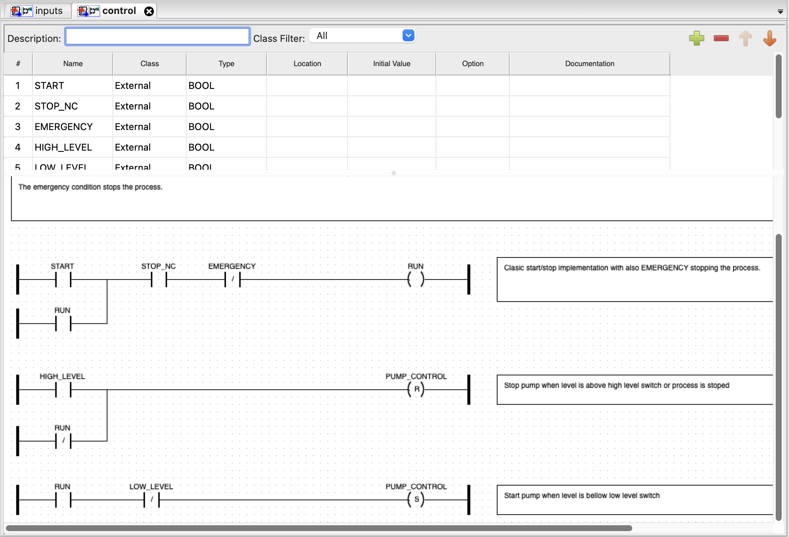
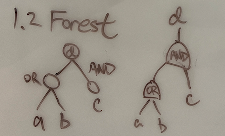

# July 3 Meeting

Weekly check-in with Michael. This time it's on Wednesday because due to Independence Day.

## Graph Design Decisions
PLC ladder logic $\Leftrightarrow$ Boolean formula/circuit

Set & Reset coils

Rising & falling coils

### NeuroSAT's approach

1. $d = (a \lor b) \land c \Rightarrow (C \lor \bar{d}) \land (\bar{C} \lor d)$ (CNF)
2. Follow *NeuroSAT* paper to build a bipartite graph: one subset of nodes contains the clauses, and the other has the literals.

    

- Pros: linearized; no recursive hierarchy
- Cons: generate graph rather than message passing; blow-up factor; denser graph

Pump control example

$$R = (R \lor S) \land NC \land E, \qquad \overline{P} \Leftarrow \overline{H \lor \neg R} = \overline{H} \land R, \qquad P \Leftarrow R \land \overline{L}$$
If we really want to transform things into CNF,
$$A = B \to (A \lor \overline{B}) \land (\overline{A} \lor B), \qquad A \Rightarrow B \to (\overline{A} \lor B), \qquad A \Leftarrow B \to (\overline{B} \lor A)$$

Another CNF conversion

$R = (A \land B) \lor (C \land D) = (A \lor C) \land (A \lor D) \land (B \lor C) \land (B \land D)$

### Modified version?

1. Linearise each rung (into CNF) for training
2. CNF $\leftrightarrow$ random walk on motif graph

### Hierarchial version

Traversal $\leftrightarrow$ tree/circuit/rung, program $\leftrightarrow$ forest

## Examples of PLC code I collected
(Head to PLCdb)

## Compiler
- RSLogix, Studio5000 (Rockwell Automation)
- TIA Portal (Siemens)
- [OpenPLC software](https://openplcproject.gitlab.io/start/index.html), completely open source but can only handle PLCopen format

- Command line parser? Library? Maybe [beremiz/beremiz](https://github.com/beremiz/beremiz?tab=readme-ov-file), or [nucleron/matiec](https://github.com/nucleron/matiec/tree/master)?

- [SimPyLC](https://github.com/QQuick/SimPyLC?tab=readme-ov-file)??? (TO READ)

## Misc (unrelated)
- Using GPT-4 to generate test cases for PLC ([link](https://github.com/hkoziolek/LLM-CodeGen-TestGen))

## Additional Repos with More Efforts
- (ST) [beremiz/beremiz](https://github.com/beremiz/beremiz/tree/python3)
- (ST, FBD, C?) [0xnkc/virtuepot/watertank](https://github.com/0xnkc/virtuepot/tree/d7df8b6a4c9d4b70cb6c4bcc7285096e65a2b4e3/watertank)