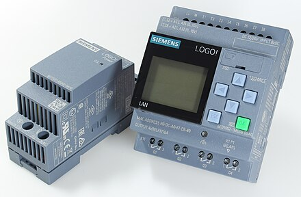
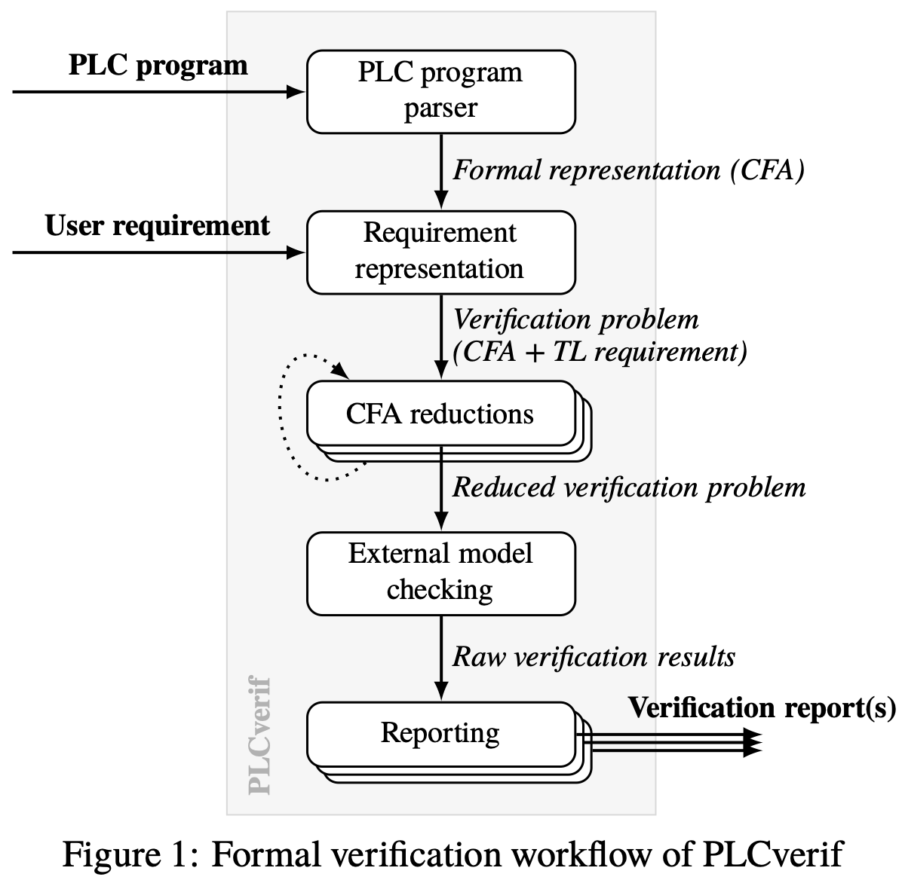
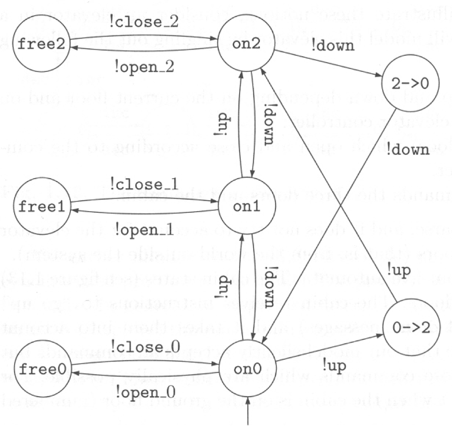
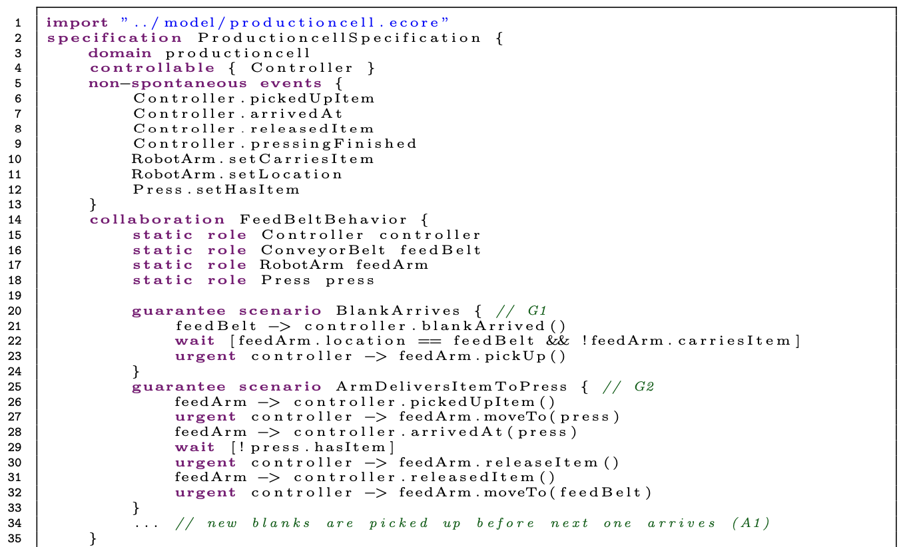

# June 13 Meeting


## What's PLC?


- (Industrial) Use case: automation e.g. manufacturing pipelines
- Major players: Siemens, Rockwell Automation, Mitsubishi Electric, Mathworks, etc.
- Modular, periodic (tight loop control)
- Event-driven: monitor input devices, output control
- Supports digital/analog input/output
- Safety

[](https://www.youtube.com/watch?v=M4yRqOgZRGA&t=55s)
[](https://www.youtube.com/watch?v=8wPHOjwPmfo&t=20s)


## PLC Programming
Five internationally recognized PLC languages, standardized under IEC61131-3:
1. Textual Programming Languages
    - Instructions List (IL, like Assembly, deprecated)
    - Structured Text (ST, like Pascal)
        * loops, case, IF, functions, maths
2. Graphical Programming Languages
    - Ladder Diagram (LD, resembling relay logic, ~~procedural~~ rule-base)
    
    - Function Block Diagram (FBD)
    
    - Sequential Function Chart (SFC)

In our case, the example [repo](https://github.com/CONTROLLINO-PLC/OpenPLC_examples/tree/master/pump_control) provided by Leidos is in *XML*, standardized by [PLCopen](https://www.plcopen.org/system/files/downloads/tc6_xml_v201_technical_doc.pdf).
Not sure if the acutal PLC code is the same: Allen Bradley by Rockwell Automation provides that service to Leidos.


## Code Example -- Pump Control with LD

The following is taken from the repo https://github.com/CONTROLLINO-PLC/OpenPLC_examples/tree/master/pump_control, which Leidos gives us an example.


- *contacts* (logical checkers) and *coils* (actuators)
- Logic: resembling [relay logic](https://en.wikipedia.org/wiki/Relay_logic)
    * AND with NOT
        ```
        -----[ ]-------------[\]------------------( )
          Key switch 1    Key switch 2         Door motor
        ```
    * OR
        ```
        --+-------[ ]-------+-----------------( )
          | Exterior unlock |                Unlock
          |                 |
          +-------[ ]-------+
            Interior unlock
        ```
    * stop, start, emergency stop
        ```
        --[\]----[\]----+--[ ]--+---------( )
          ES    Stop    | Start |         Run
                        |       |
                        +--[ ]--+
                           Run
        ```

<details>
<summary>Input program</summary>

```xml
<pous>
  <pou name="inputs" pouType="program">
    <interface>
      <localVars>
        <variable name="AI2" address="%IX0.0">
          <type>
            <BOOL/>
          </type>
        </variable>
        ...
      </localVars>
      <externalVars>
        <variable name="PUMP_ON">
          <type>
            <BOOL/>
          </type>
        </variable>
        ...
      </externalVars>
    </interface>

      <LD>
        <leftPowerRail localId="16" height="40" width="10">
          <position x="10" y="480"/>
          <connectionPointOut formalParameter="">
            <relPosition x="10" y="20"/>
          </connectionPointOut>
        </leftPowerRail>
        <contact localId="17" height="20" width="21" negated="false">
          <position x="70" y="490"/>
          <connectionPointIn>
            <relPosition x="0" y="10"/>
            <connection refLocalId="16">
              <position x="70" y="500"/>
              <position x="20" y="500"/>
            </connection>
          </connectionPointIn>
          <connectionPointOut>
            <relPosition x="21" y="10"/>
          </connectionPointOut>
          <variable>AI2</variable>
        </contact>
        <coil localId="18" height="20" width="21" negated="false">
          <position x="190" y="490"/>
          <connectionPointIn>
            <relPosition x="0" y="10"/>
            <connection refLocalId="17">
              <position x="190" y="500"/>
              <position x="91" y="500"/>
            </connection>
          </connectionPointIn>
          <connectionPointOut>
            <relPosition x="21" y="10"/>
          </connectionPointOut>
          <variable>PUMP_ON</variable>
        </coil>
        <rightPowerRail localId="1" height="40" width="10">
          <position x="280" y="480"/>
          <connectionPointIn>
            <relPosition x="0" y="20"/>
            <connection refLocalId="18">
              <position x="280" y="500"/>
              <position x="211" y="500"/>
            </connection>
          </connectionPointIn>
        </rightPowerRail>

        <leftPowerRail ...>
          ...
        </leftPowerRail>
        <contact ...>
            ...
            <variable>AI3</variable>
        </contact>
        <coil ...>
          ...
          <variable>HIGH_LEVEL</variable>
        </coil>
        <rightPowerRail ...>
          ...
        </rightPowerRail>
        
        ...
        </LD>
    </body>
</pou>
```
POU = program organization unit
</details>

<details>
<summary>Control program</summary>

```xml
<pou name="control" pouType="program">
  <interface>
    <externalVars>
      <variable name="START">
        <type>
          <BOOL/>
        </type>
      </variable>
      ...
      <variable name="EMERGENCY">
        <type>
          <BOOL/>
        </type>
      </variable>
      ...
    </externalVars>
  </interface>

  <body>
    <LD>
      ...
      <contact ...>
        ...
        <variable>STOP_NC</variable>
      </contact>
      <coil ...>
        ...
        <variable>RUN</variable>
      </coil>
      <comment localId="159" height="60" width="590">
        <position x="670" y="200"/>
        <content>
          <xhtml:p>
            <![CDATA[Clasic start/stop implementation
            with also EMERGENCY stopping the process.]]>
          </xhtml:p>
        </content>
      </comment>
      <contact ...>
        ...
        <variable>RUN</variable>
      </contact>
      <contact ...>
        ...
        <variable>EMERGENCY</variable>
      </contact>
    </LD>
  </body>
</pou>
```

Errr... What about this? 😮

</details>

<details>
<summary>Output program</summary>

```xml
<pou name="outputs" pouType="program">
  <interface>
    <localVars>
      <variable name="DO0" address="%QX0.0">
        <type>
          <BOOL/>
        </type>
      </variable>
      ...
    </localVars>
    <externalVars>
      ...
      <variable name="LOW_LEVEL">
        <type>
          <BOOL/>
        </type>
      </variable>
      ...
    </externalVars>
  </interface>

  <body>
    <LD>
      <leftPowerRail ...>
        ...
      </leftPowerRail>
      <contact ...>
        ...
        <variable>PUMP_ON</variable>
      </contact>
      <coil ...>
        ...
        <variable>DO1</variable>
      </coil>
      <rightPowerRail ...>
        ...
      </rightPowerRail>

      ... 
    </LD>
  </body>
</pou>
```
</details>


## Other Datasets

- As always, knowing more context can help.
- **Confirm** if we have to work with the PLC XML code.

Funny: https://www.reddit.com/r/PLC/comments/8uddci/where_do_you_all_go_for_examples_of_plc_code_is/.
Some ideas?
- Rockwell Automation Sample Code Library:
https://www.rockwellautomation.com/en-us/support/product/product-downloads/application-code-library/sample-code.html
- Manual / books:
    - Beckhoff manual:
    https://infosys.beckhoff.com/english.php?content=../content/1033/tc3_plc_intro/12049233675.html&id=6398798947359024199
- Courses:
    - SIEMENS: https://www.realpars.com/courses/siemens-plc-basics.
- Hmmm: http://www.plcs.net/downloads/


## Some Further Research...
Legend: 💾 dataset included, 👍 probably worth looking

- *Formal methods in PLC programming* (Survey), https://ieeexplore.ieee.org/abstract/document/884356.

### Simulation
- *Many* proprietary software
- *Engineering Life cycle with mechanical & control simulation in industry*, https://ieeexplore.ieee.org/abstract/document/8780213.

- *(Same as above)*, https://ieeexplore.ieee.org/abstract/document/4736071.

### Verification
Formal methods v.s. Model checking
- *PLCverify*, https://arxiv.org/abs/2203.17253. CERN (2022).
    <details>
    <summary>Open-source formal verification tool developed for their PLC</summary>

    
    </details>
- 💾 *SymPLC*, https://dl.acm.org/doi/abs/10.1145/3106237.3106245.
    * symbolic execution: 93 PLC programs (26713 lines) $\to$ program paths in 62926 lines of C $\to$ tasks as threads with different priorities
    * Sources: single-task [16, 18, 29], multi-task [14, 15].
- *Verification/optimization using some software*, https://link.springer.com/article/10.1007/s10009-002-0079-0. (?)

### Code Synthesis
- 👍 *PLCspecif: code gen with formal specification*, https://ieeexplore.ieee.org/abstract/document/7819191. CERN (2016).
    * automata $\to$ control flow graph 
        <details>
        <summary>More on automata</summary>

        1. Elevator control example with state machine
          
        2. This [class](https://www.fi.muni.cz/~xpelanek/IA158/?action=references) at Masaryk University gives intro to automata modelling.
        </details>
- *Scenario-based specification + Game theory* (machine vs environment), https://link.springer.com/chapter/10.1007/978-3-319-74730-9_23.
    <details>
    <summary>Spec example</summary>

    
    </details>
- *Code generation based on knowledge from engineering artifacts*, https://ieeexplore.ieee.org/abstract/document/6489546. (?)

### Learn PLC Logic from Data
- 💾 *Time-series data for feature pruning & cycle detection*, https://paperswithcode.com/paper/information-based-preprocessing-of-plc-data.
- 💾 *Robot PLC execution data*, https://catalog.data.gov/dataset/process-and-robot-data-from-a-two-robot-workcell-representative-performing-representative-. NIST (2021). *(Not research)*
- *Decision Tree for Learning PLC Logic from data*, https://github.com/sakchy/Machine-Learning-for-PLC-Control-Code.

### Less relevant stuff
#### "Visualization"
- *PLC $\to$ vendor-independent XML $\to$ DOM*, https://folk.ntnu.no/skoge/prost/proceedings/acc04/Papers/0546_ThM14.6.pdf.

Some super unrelated stuff too, e.g., PLC market, [classified photos of PLCs](https://universe.roboflow.com/dataset-plc/plc-yuevb), [reliable PLC simulation issues](https://ieeexplore.ieee.org/abstract/document/6121945/metrics#metrics).
Related but kind of useless: [Automatic testing v.s. Model checking: pros & cons](https://accelconf.web.cern.ch/ICALEPCS2013/papers/thppc080.pdf).