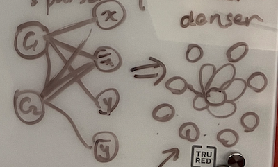

# June 27 Meeting

Weekly check-in with Michael.

## Code Repositories
- 🤔 [PLCs.net](http://www.plcs.net/downloads/), a rather huge data repository
    > The source is from members of this forum. They are free for your use.

- (Siemens) [mateusz-talma/PLC-Siemens-S7-1200](https://github.com/mateusz-talma/PLC-Siemens-S7-1200/tree/master)
- (Siemens LOGO!) [shawonhimu/plc](https://github.com/shawonhimu/plc) (~10)

## Graph Structure Proposals
PLC ladder logic $\Leftrightarrow$ Boolean formula/circuit

### NeuralSAT's approach

1. $d = (a \lor b) \land c \Rightarrow (C \lor \bar{d}) \land (\bar{C} \lor d)$ (CNF)
2. Follow *NeuralSAT* paper to build a bipartite graph: one subset of nodes contains the clauses, and the other has the literals.

- Pros: linearized; no recursive hierarchy
- Cons: generate graph rather than message passing; blow-up factor; denser graph

Pump control example

$$R = (R \lor S) \land NC \land E, \qquad P = \overline{H \lor \neg R} = \overline{H} \land R, \qquad P = R \land \overline{L}$$

Another CNF conversion

$R = (A \land B) \lor (C \land D) = (A \lor C) \land (A \lor D) \land (B \lor C) \land (B \land D)$

### Modified version?

1. Linearise each rung (into CNF) for training
2. CNF $\leftrightarrow$ random walk on motif graph

### Hierarchial version

Traversal $\leftrightarrow$ tree/circuit/rung, program $\leftrightarrow$ forest

## Compiler
- RSLogix, Studio5000 (Rockwell Automation)
- TIA Portal (Siemens)
- [OpenPLC software](https://openplcproject.gitlab.io/start/index.html), completely open source but can only handle PLCopen format

- Command line parser?

- [SimPyLC](https://github.com/QQuick/SimPyLC?tab=readme-ov-file)??? (TO READ)