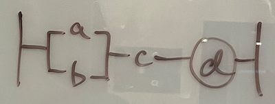
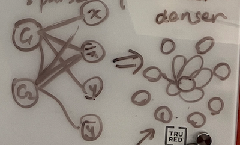
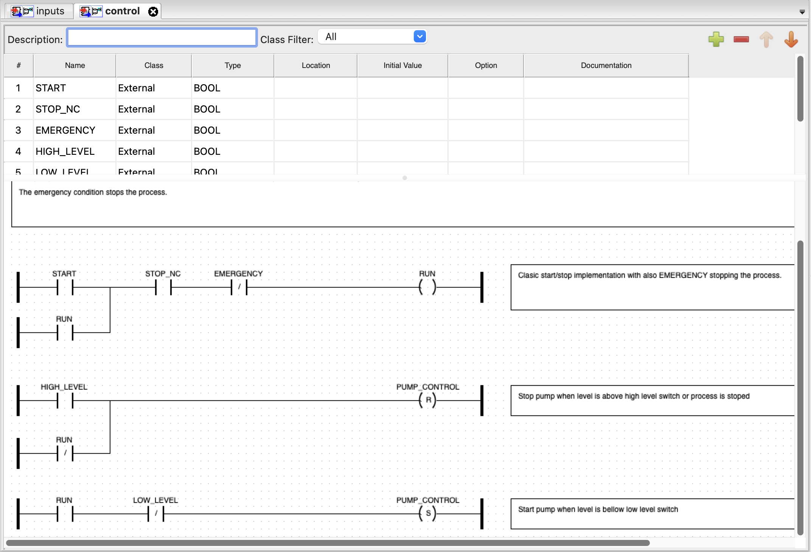
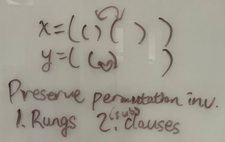

# June 27 Meeting

Weekly check-in with Michael.

## Code Repositories
- 🤔 [PLCs.net](http://www.plcs.net/downloads/), a rather huge data repository
    > The source is from members of this forum. They are free for your use.

I've been going through the following repos, which are more accessible:
- (1 large) (XML, Beckhoff) [Beckhoff-USA-Community/PackML_PLC_Example](https://github.com/Beckhoff-USA-Community/PackML_PLC_Example)
- (1) (XML, Codesys) [tkucic/plc_hello_mixing_tank](https://github.com/tkucic/plc_hello_mixing_tank)
- (~15) (Siemens) [mateusz-talma/PLC-Siemens-S7-1200](https://github.com/mateusz-talma/PLC-Siemens-S7-1200)
- (~10) (Siemens LOGO!) [shawonhimu/plc](https://github.com/shawonhimu/plc)
- Other larger code libraries/examples not yet accessible without proprietary software (still connecting with companies)

(Issues mentioned before: these examples might be like "Hello World" in programming, not sure about the quality of grammar learned.)
- (small examples) [Mitsubishi Electric MELSOFT Library](https://www.mitsubishielectric-fa.cn/fb/english/melsoft_library/fa/products/cnt/plceng/download/library/other_languages.html)
- (small examples) [Beckhoff infosys](https://infosys.beckhoff.com/)

## Graph Structure Proposals
PLC ladder logic $\Leftrightarrow$ Boolean formula/circuit

### NeuroSAT's approach

1. $d = (a \lor b) \land c \Rightarrow (C \lor \bar{d}) \land (\bar{C} \lor d)$ (CNF)
2. Follow *NeuroSAT* paper to build a bipartite graph: one subset of nodes contains the clauses, and the other has the literals.

- Pros: linearized; no recursive hierarchy
- Cons: generate graph rather than message passing; blow-up factor; denser graph

Pump control example

$$R = (R \lor S) \land NC \land E, \qquad P = \overline{H \lor \neg R} = \overline{H} \land R, \qquad P = R \land \overline{L}$$

Another CNF conversion

$R = (A \land B) \lor (C \land D) = (A \lor C) \land (A \lor D) \land (B \lor C) \land (B \land D)$

### Modified version?

1. Linearise each rung (into CNF) for training
2. CNF $\leftrightarrow$ random walk on motif graph

### Hierarchial version

Traversal $\leftrightarrow$ tree/circuit/rung, program $\leftrightarrow$ forest

## Compiler
- RSLogix, Studio5000 (Rockwell Automation)
- TIA Portal (Siemens)
- [OpenPLC software](https://openplcproject.gitlab.io/start/index.html), completely open source but can only handle PLCopen format

- Command line parser? Library?

- [SimPyLC](https://github.com/QQuick/SimPyLC?tab=readme-ov-file)??? (TO READ)

## Misc (unrelated)
- Using GPT-4 to generate test cases for PLC ([link](https://github.com/hkoziolek/LLM-CodeGen-TestGen))